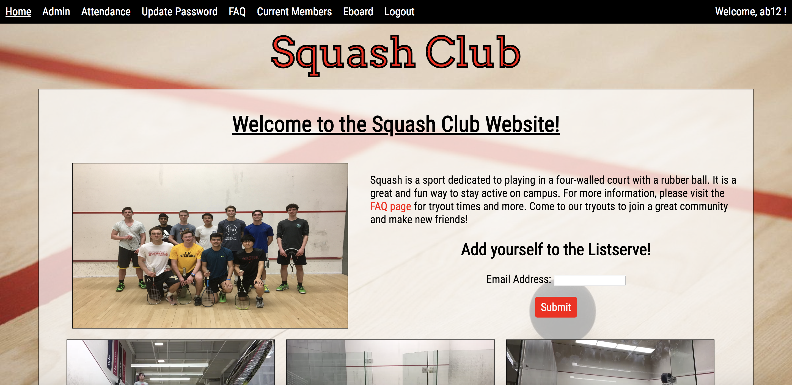
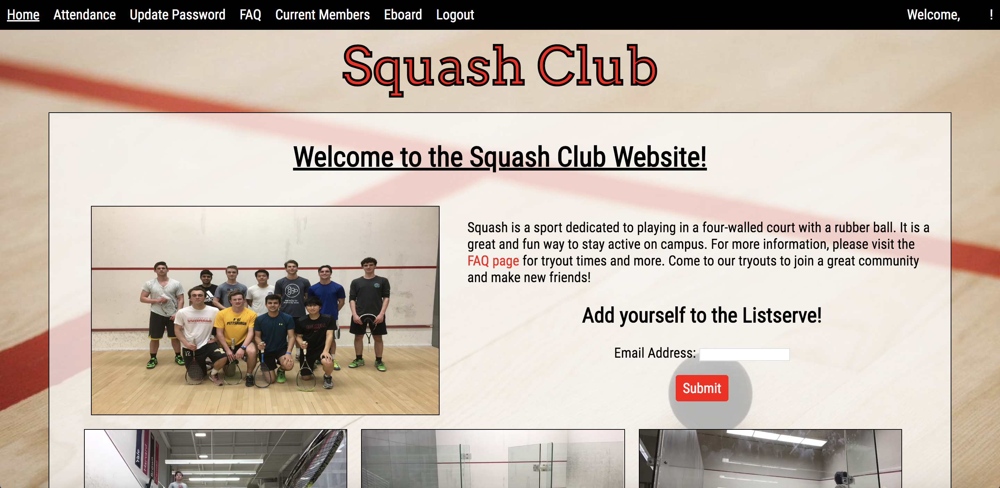
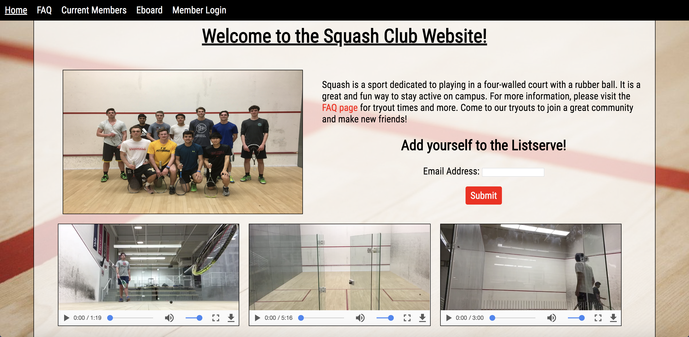
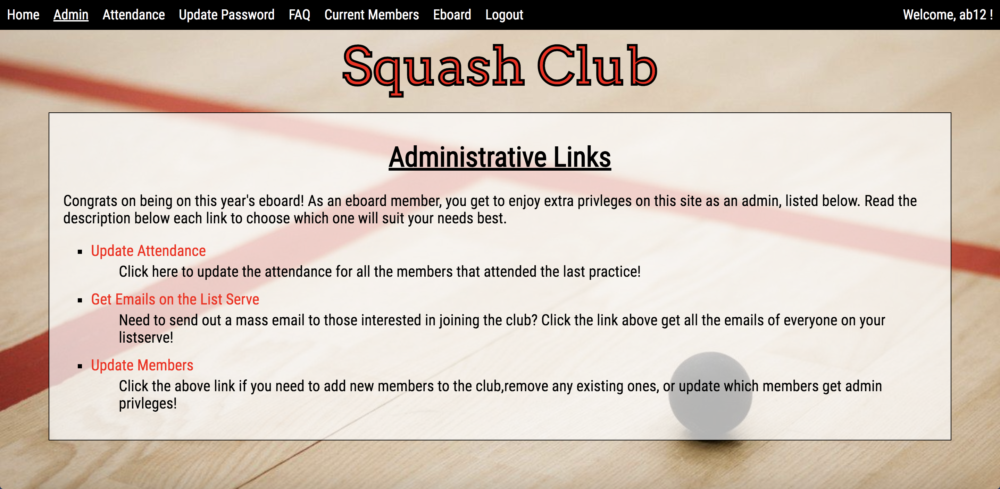
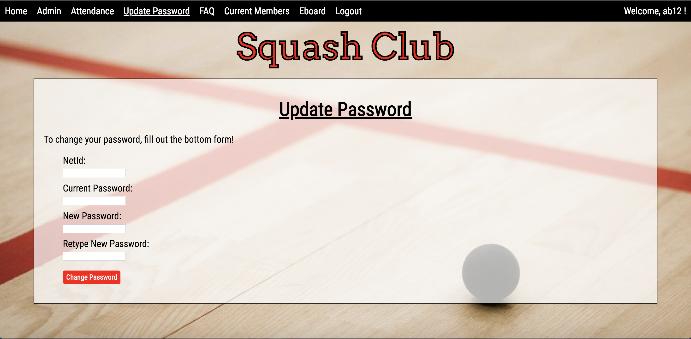
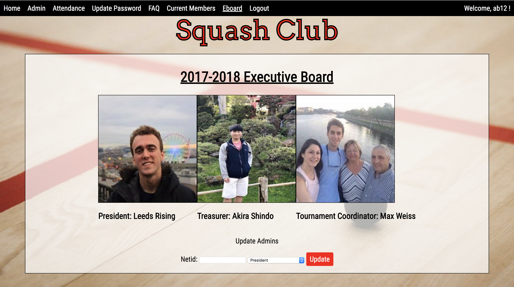
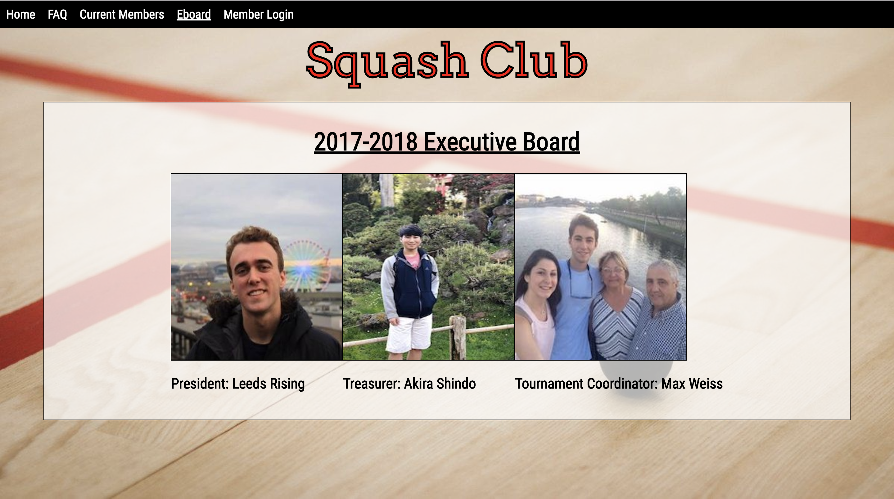

### Introduction ###

Come and explore Cornell Club Squash's official website! See the current members,
current eBoard members, FAQs, and get a general introduction to the club! Are you
a member? Login using your netID and password to gain access to more information--
like the number of practices you've attended, the practices you've attended, and
a place to update your password from the default. If your a member of the eBoard,
login to get access to all the features! You can update your records and to
say which member(s) went to which practice(s), update the eBoard members, and much
more! Whether you're on a computer or a mobile device, come and explore this site!

### Logistics ###
This website was the term project for Info2300. For this project, teams of five people were to go and find a client and build a website for them. It must use databases, have login and logout features, and practice good design principles. We are currently in the process of launching the site.

Here are some snapshots of the site:

Top portion of the home page (logged in as an admin)


Home page as a member, but not an admin (netID redacted)


Bottom portion of the home page (not a member of the club)


Admin page -- only accessible by members of the eBoard


Update Password page -- only accessible by members of the club


eBoard page (admin view)-- admin can update the eboard


eBoard page (not admin view) -- user cannot update eboard



From the first three pictures, you can see that the menu bar at the top of the screen changes based on who's on the site: an admin; a member, but not an admin; and someone who's not part of the club. As you progress down the list (either of the audience or of the pictures), you can see fewer and fewer links displayed. Moreover, the admin has: an admin link, an attendance link, and an update password link. The member does not have an admin link because they do not have these privileges. The non-member has none of these.

Additionally, only admins can update the eBoard page


### Running ###
First clone this repository. To run the php on a local server, you can use the terminal commands:
```
cd path/to/your/app
php -S localhost:8000
```

To test around with the admin abilities, use the "For Demo" member of the club. To login, his username and password is: **ab12**
